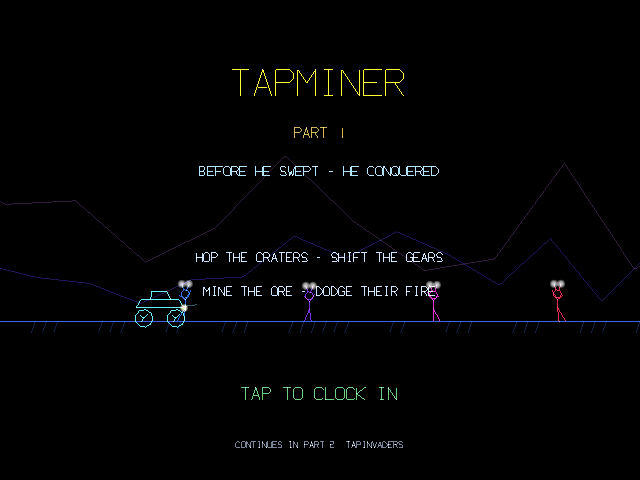
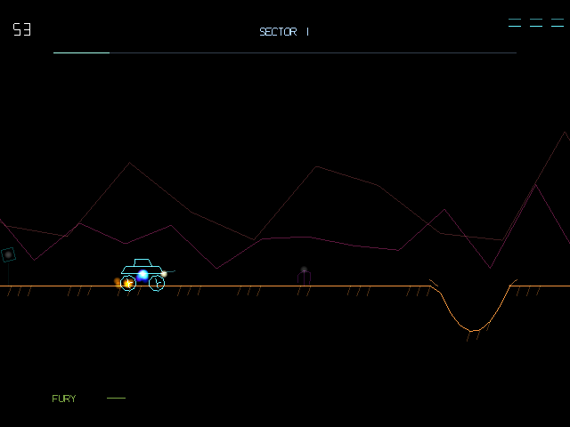

# TapMiner

TapMiner is a synthwave neon-vector take on the 1982 lunar side-scroller, built for the RayNeo X3 Pro AR glasses as a prequel to TapMeteors and TapInvaders. It follows an indentured mining intern whose job is to strip-mine the moon, told through parallax mountains, an Earthrise floating in the distance, and titled intermission cutscenes narrated in an invented alien language. The core tension is that mining ore requires staying low to the ground, while surviving requires hopping over craters, boulders, and incoming bombs — every dodge is ore left behind, and every crystal collected visibly provokes the moon's native inhabitants, who go from peaceful onlookers to armed aggressors as a fury meter climbs across the game's sectors.

## Screenshots

  
  

## Controls

- Tap to hop the rover over hazards
- Swipe forward/back to shift gears, trading speed and score against reaction time

## Download

[TapMiner.apk](TapMiner.apk)
